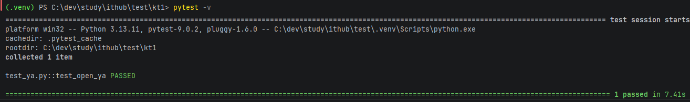

# Тест открытия Яндекс

Этот проект содержит простой тест с использованием `pytest` и `Selenium`, который проверяет возможность открытия сайта Яндекс и корректность заголовка страницы.

## Установка

2. Зависимости:

```bash
pip install -r requirements.txt
```

## Запуск теста

```bash
pytest test_ya.py
```

Где `test_ya.py` — это имя файла с тестом.

## Структура теста

- `browser` — фикстура `pytest`, которая инициализирует Chrome WebDriver перед тестом и закрывает его после выполнения.
- `test_open_ya` — тест, который открывает сайт `https://ya.ru` и проверяет, что в заголовке страницы встречается слово `яндекс` (независимо от регистра).

3. Отчет
